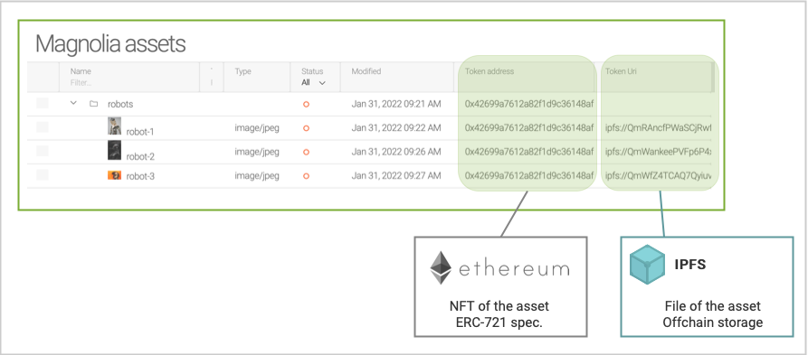
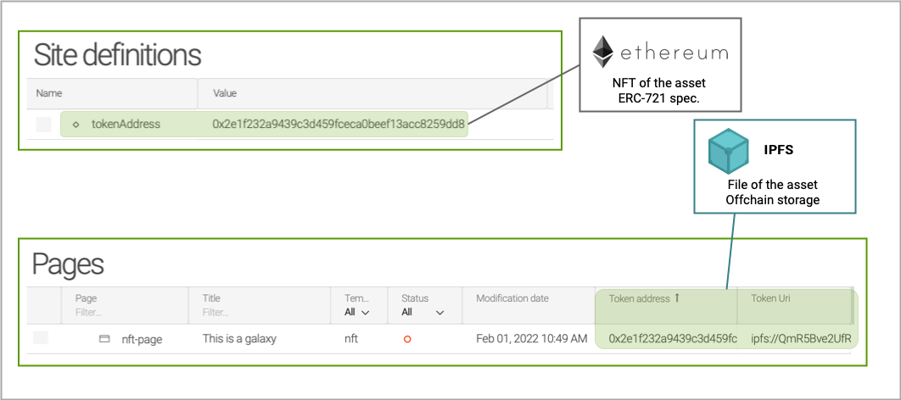
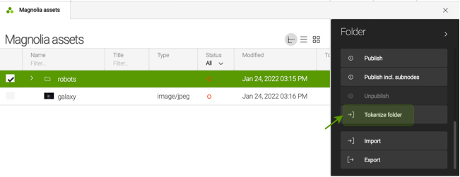
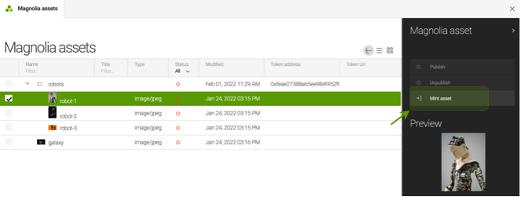
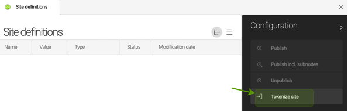
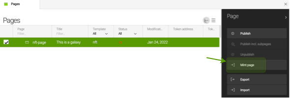
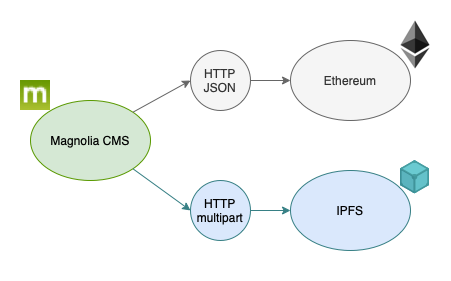
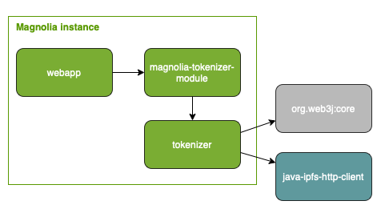

# Magnolia tokenizer
*magnolia-tokenizer-module* is a module of [Magnolia CMS](https://www.magnolia-cms.com) that allows the tokenization of contents in NFT's. Contents can be assets and pages stored in [Magnolia CMS](https://www.magnolia-cms.com).  

# Motivation
I like reading and watching articles, videos, photos etc. made by creators and a nice an easy way to contribute to their work is buying the NFT of their creations.  

This feature of [Magnolia CMS](https://www.magnolia-cms.com), allows creators to deploy NFT's easily for the contents of their websites.   

## Tokenization of assets
The tokenization of asseets creates collections of NFT's - smart contracts [ERC-721](https://eips.ethereum.org/EIPS/eip-721) - for **folders of assets** and *mints* the **assets** in the smart contract.
> **What is minting?**
>
> Minting is the operation of creating a NFT and commonly consists in uploading the asset to [IFPS](https://ipfs.io) and adding the URI to an [ERC-721](https://eips.ethereum.org/EIPS/eip-721) contract.

The following diagram shows the result of tokenizing assets.
  


## Tokenization of pages
The tokenization of pages deploys an [ERC-721](https://eips.ethereum.org/EIPS/eip-721) contract for the site and *mints* the pages in the smart contract of the site. The asset uploaded to [IFPS](https://ipfs.io) is the result of rendering pages as [PDF](https://www.adobe.com/acrobat/pdf-reader.html).

The following diagram shows the result of tokenizing pages.
  


## How it works?
### How to tokenize assets
#### 1. Tokenize the folder of assets
The tokenization of a folder will deploy in [Ethereum](https://ethereum.org) a smart contract that will collect the NFT's created from the assets of [Magnolia CMS](https://www.magnolia-cms.com).


#### 2. Mint assets
Minting assets in [Magnolia CMS](https://www.magnolia-cms.com) will upload the asset to [IFPS](https://ipfs.io) and add the URI to the smart contract of the folder.


### How to tokenize pages
#### 1. Tokenize the site
The tokenization of the site will deploy in [Ethereum](https://ethereum.org) a smart contract that will collect the NFT's created from the pages of the site.


#### 2. Mint pages of the site
Minting pages will render the page as [PDF](https://www.adobe.com/acrobat/pdf-reader.html) and upload the result to [IFPS](https://ipfs.io). The URI will be added to the smart contract of the site.


## Start working!
It is provided a [docker compose](https://docs.docker.com/compose/) that starts the infrastructure to start working:
- Instance of [Magnolia CMS](https://www.magnolia-cms.com). Available at http://127.0.0.1:8090/
- Node of [Ethereum](https://ethereum.org) to store the NFT's. Available at http://127.0.0.1:8545
- Node of [IFPS](https://ipfs.io)to store assets of NFT's'. Available at http://127.0.0.1:5001/webui

```shell
$ mvn clean package -DskipTests
$ docker compose up -d
```
## Architecture
### Deployment
Systems involved in the deployment are
- Instance of [Magnolia CMS](https://www.magnolia-cms.com)
- Blockchain network - [Ethereum](https://ethereum.org)
- Distributed filesystem - [IFPS](https://ipfs.io) 



### Development
The following diagram shows the dependency between artifacts of the project

> **magnolia-tokenizer-module**
> 
> Artifact that implements the module of magnolia responsible for tokenizing contents.

> **tokenizer**
> 
> Library that implements the integration with blockchain network and the distributed filesystem.

> **org.web3:core**
> 
> SDK for [Ethereum](https://ethereum.org)

> **java-ipfs-http-client**
> 
> SDK for [IFPS](https://ipfs.io)

## Usage
Add the dependency with the module *magnolia-tokenizer-module* 
```xml
<dependency>
  <groupId>org.formentor</groupId>
  <artifactId>magnolia-tokenizer-module</artifactId>
  <version>1.0-SNAPSHOT</version>
</dependency>
```

### Setup
#### Ethereum host address
The url of the node or gateway that will receive the Ethereum transactions -e.g. creation of smart contracts and minting of assets - is specified by the environment variable ETHEREUM_ADDRESS. 
> Example
> http://besu:8545

#### Ethereum account
The private key of the account that will send transactions to Ethereum is specified by the env. variable ETHEREUM_ACCOUNT.
> Example
> 0x8f2a55949038a9610f50fb23b5883af3b4ecb3c3bb792cbcefbd1542c692be63

#### Ipfs address
The address of the host or gateway that will receive requests to add files in IPFS is specified by the env. variable IPFS_ADDRESS.
> Example
> "/dns6/ipfs/tcp/5001/http"

## How to

###  How to download asset from ipfs
- Using a browser
```shell
$ curl -O http://127.0.0.1:8080/ipfs/QmRAncfPWaSCjRwfHnsG2jwYFuRAcNCWsMbf8iQB5ZcKE7/robot-1.jpg
```
- Using the client of ipfs 
```shell
$ docker exec magnolia-tokenizer-bundle-magnolia-1 cat /ipfs/QmRAncfPWaSCjRwfHnsG2jwYFuRAcNCWsMbf8iQB5ZcKE7/robot-1.jpg > image.jpg
```